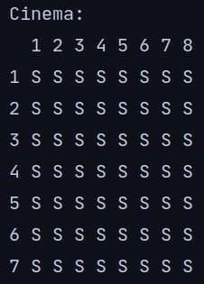
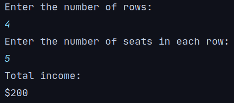
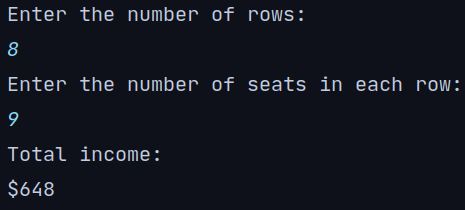
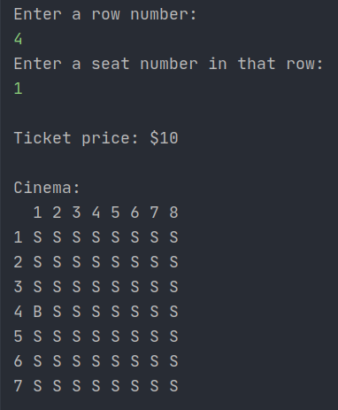

# CINEMA ROOM MANAGER

Proyecto de Jetbrains Academy para practicar java.

## Stage 1/5
Para iniciar se debe imprimir la disposición de la sala de cinema de la siguiente forma:

## Stage 2/5
In this stage, you need to read two positive integer numbers from the input: the number of rows and the number of seats
in each row. The ticket price is determined by the following rules:

* If the total number of seats in the screen room is not more than 60, then the price of each ticket is 10 dollars. 
* In a larger room, the tickets are 10 dollars for the front half of the rows and 8 dollars for the back half. Please note that the number of rows can be odd, for example, 9 rows. In this case, the first half is the first 4 rows, and the second half is the other 5 rows.

Calculate the profit from the sold tickets depending on the number of seats and print the result as shown in the
examples below. After that, your program should stop. Note that in this project, the number of rows and seats won't be
greater than 9.

## Stage 3/5
Read two positive integer numbers that represent the number of rows and seats in each row and print the seating
arrangement like in the first stage. Then, read two integer numbers from the input: a row number and a seat number
in that row. These numbers represent the coordinates of the seat according to which the program should print the ticket
price. The ticket price is determined by the same rules as the previous stage:

* If the total number of seats in the screen room is not more than 60, then the price of each ticket is 10 dollars.
* In a larger room, the tickets are 10 dollars for the front half of the rows and 8 dollars for the back half. Please note that the number of rows can be odd, for example, 9 rows. In this case, the first half is the first 4 rows, and the second half is the last 5 rows.

After that, the program should print out all the seats in the screen room as shown in the example and mark the chosen
seat by the `B` symbol. Finally, it should print the ticket price and stop. Note that in this project, the number of rows
and seats won't be greater than 9.

esto es un cambio sencillo para practicar git con SSH